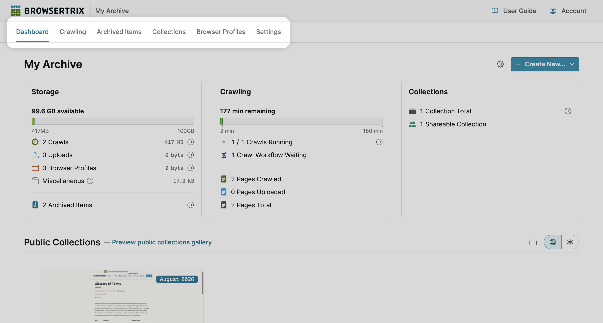
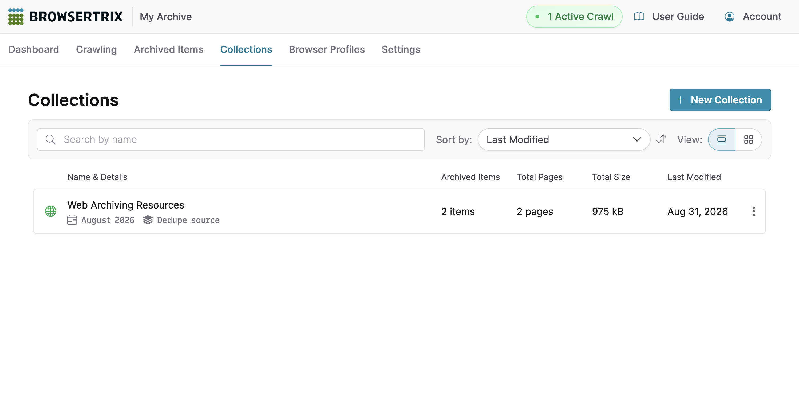
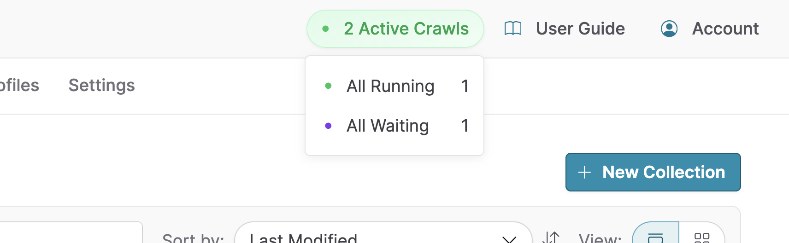
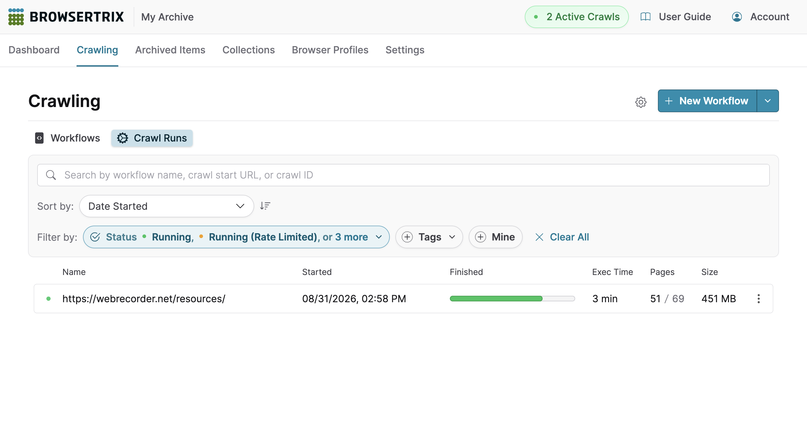
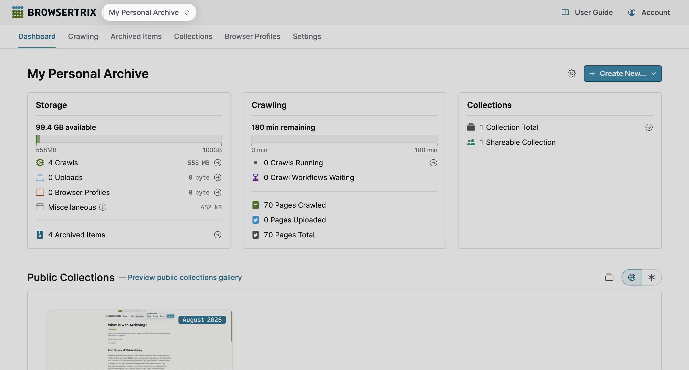
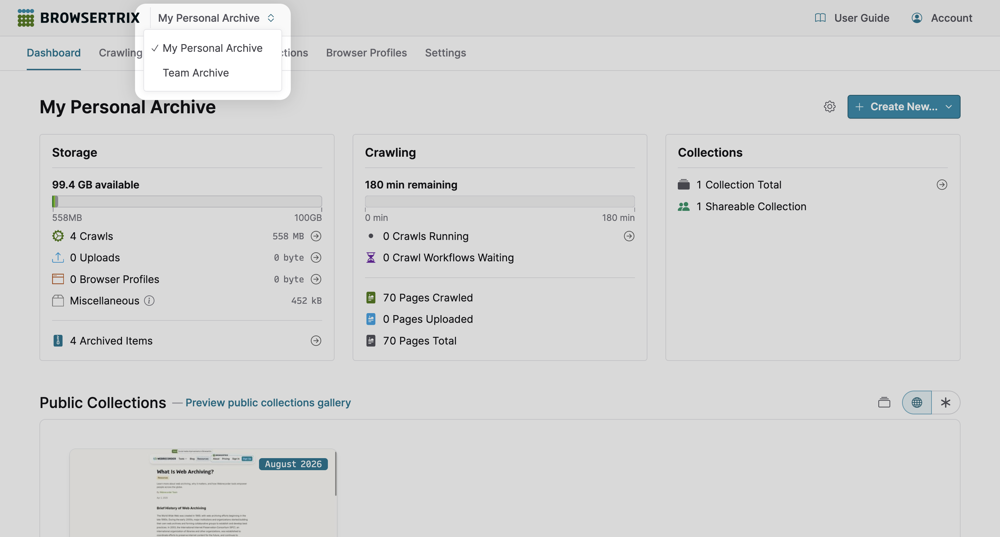

# Navigating Browsertrix

## Navigate Your Org

You can find links to navigate your org near the top of each page, directly below the top-level navigation bar with the Browsertrix logo.

{ .wr-image }

### Org Pages

- **Dashboard**: Track org usage statistics and public collections.
- **Crawling**: Manage crawl workflows, run crawls, and view active crawls.
- **Archived Items**: Manage, import, and search for archived items.
- **Collections**: Manage collections.
- **Browser Profiles**: Manage browser profiles.
- **Settings**: Edit org information, manage billing and subscription plan, and add or remove org members.

!!! Question "Why don‘t I see the “Settings” link?"
    The link to **Settings** will not be available if you were invited to join an existing org and were not given permission to administrate the org. Contact your org administrator if this appears to be a mistake.

---

## Navigate to Active Crawls

If any crawls in your org are active–i.e. visiting pages, waiting to visit pages, or temporarily paused–a link indicating the total number of active crawl runs will appear at the top of every page, next to the **User Guide** button.

{ .wr-image }

Hover over or focus on the total number of crawls to view a breakdown of running, waiting, or paused crawl runs.

{ .wr-image }

Tapping the total number or selecting a status will take you to a view of the crawl runs filtered by that status and its sub-statuses.

{ .wr-image }

---

## Navigate to Another Org

If you belong to multiple orgs, a dropdown indicator will appear next to the org name that appears at the top of every page.

{ .wr-image }

You can view all the orgs you belong to by tapping the current org’s name.

{ .wr-image }

To switch to another org, select the org name from the dropdown.
