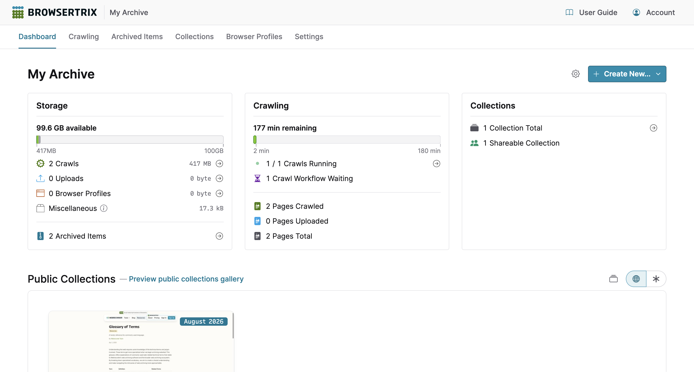

# Org Dashboard

Get an overall picture of how your org archives
{ .hero-paragraph }

## Introduction { .invisible }

---

The dashboard is the first page that you see when you log in. It gives you access to essential stats and a _Create New ..._ shortcut to quickly add a crawl workflow, collection, browser profile, or uploaded item.

{ .wr-image }

## Usage Stats and Quotas

Usage statistics and quotas will be visible once your org contains web archiving data.

### Storage

The storage panel displays the total size and count of archived items and browser profiles.

For organizations with a set storage quota, the storage panel displays a visual breakdown of how much space the organization has left and how much has been taken up by all types of archived items and browser profiles. To view additional information about each item, hover over its section in the graph.

??? Info "Miscellaneous storage"
    You may see an additional _Miscellaneous_ size depending on your crawl workflow and collection configuration. _Miscellaneous_ is the total size of all supplementary files in use by your organization, such as [workflow URL list files](./workflow-setup.md#list-of-pages) and [custom collection thumbnails](./presentation-sharing.md#thumbnail).

### Crawling

The crawling panel lists the number of currently running and waiting crawls, as well as the total number of pages captured.

#### Execution Time

`Subscription Feature`{ .badge-green .btrix-embed-hidden }

For organizations with a set execution minute limit, the crawling panel displays a graph of how much execution time has been used and how much is currently remaining. Monthly execution time limits reset on the first of each month at 12:00 AM GMT.

??? Question "How is execution time calculated?"
    Execution time is the total runtime of a crawl scaled by the [_Browser Windows_](workflow-setup.md/#browser-windows) value during a crawl. Like elapsed time, this is tracked while the crawl runs. Changing the amount of _Browser Windows_ while a crawl is running may change the amount of execution time used in a given time period.

### Collections

The collections panel displays the number of total collections and collections marked as sharable.

## Public Collections

If any of org collections are [public](public-collections-gallery.md), their thumbnails will be displayed in the **Public Collections** section of the dashboard.
